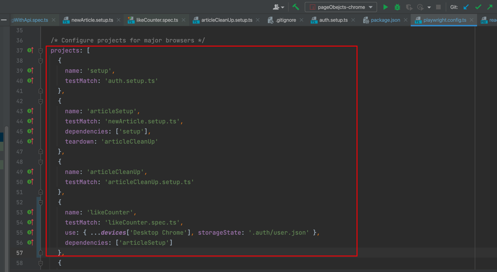
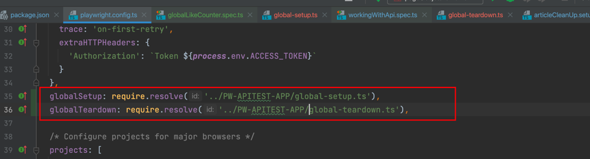
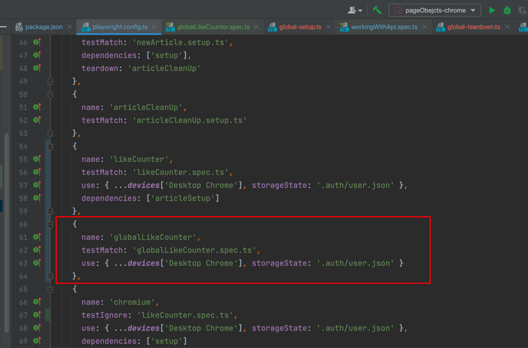

# URLs
APP: https://conduit.bondaracademy.com/

API: https://conduit-api.bondaracademy.com/

# CLI command
## 1. run in diff web browser
```shell
npm run pageObejcts-firefox
npm run pageObejcts-chrome
npm run pageObejcts-all
```
## 2. install data generator-faker
```shell
npm install @faker-js/faker --save-dev --force
```
## 3. project setup and teardown
```shell
npm run pageObejcts-likeCounter-ui
```

## 4.global setup and teardown
```shell
npm run pageObejcts-globalLikeCounter
```



